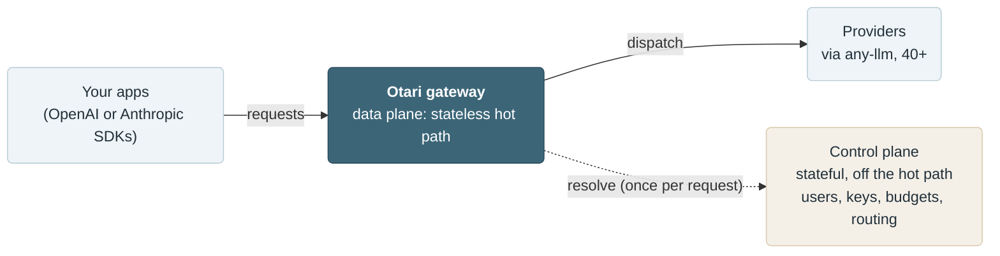
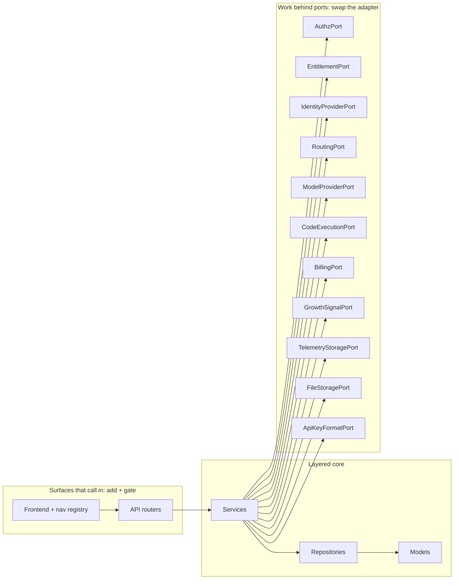

# Architecture

Otari is an OpenAI-compatible LLM gateway, built to be extended. Its core defines a small set of interfaces, called **ports**, and delegates real work to **adapters** that implement them. The core depends only on the ports, never on a specific adapter, so you can supply your own adapter and run it with Otari without changing Otari's code. If you have your own code-execution platform, for example, an adapter that satisfies `CodeExecutionPort` lets Otari drive it; the same is true for routing, identity, and the other ports below.

An **overlay** is a build that layers its own adapters (and its own routers and pages) on top of Otari through these extension points. otari.ai's edition is one such overlay, but it is one among possible many, and nothing in this document is specific to it. This is the open-core shape: Otari is the Apache-2.0 base that stands on its own, and an overlay adds capabilities along a published boundary.

This document is for contributors changing the *shape* of the system. It explains where that boundary is, what Otari's core provides versus what an overlay supplies, and how to add a capability without crossing the line. For the request-level, user-facing picture, start with [docs/index.md](docs/index.md) and [docs/modes.md](docs/modes.md).

## Status: this is a north-star document

This describes the architecture the codebase is **heading toward**, not the whole of what exists today. Otari today is the gateway (the data plane) plus a standalone management API; the ports package, the composition container, and the bootstrap hook are in the tree, and the rest, including the control-plane UI described below, arrives as Otari grows into the full open-source base.

Read it with that in mind:

- **"Today" statements** are grounded in what is actually in `src/gateway/` right now, and say so.
- **"Planned" statements** describe target structures that do not exist in the tree yet. Where a structure is planned, the doc names where it will live rather than pretending it is already there.
- A few capability-line rows are explicitly marked **provisional**: the split between what Otari ships and what an overlay adds is a working assumption for those rows, pending a decision, not settled fact.

As the seam is built out, this document and the mechanical boundary check that enforces it (see [Cardinal rules](#cardinal-rules-for-contributors)) are updated together, so the human-readable boundary and the enforced one do not drift.

## The two planes

Otari separates a **data plane** from a **control plane**.

- **Data plane**: the gateway hot path. It authenticates the request, applies input guardrails, runs any built-in tools, and dispatches the provider call through [`any-llm`](https://github.com/mozilla-ai/any-llm). It is stateless and scales with traffic. Today it runs in `src/gateway/`: the request lifecycle in `src/gateway/api/routes/chat.py` (and its siblings `messages.py`, `responses.py`), with streaming in `src/gateway/streaming.py`. `src/gateway/` today also houses the standalone control plane described below, so the package as it stands is not the data plane alone.
- **Control plane**: everything off the hot path. It owns users, orgs, workspaces, keys, budgets, usage, and the routing decision. It is stateful and database-backed. It makes the policy decisions; the data plane executes them.

On the request hot path the two meet through the **resolve protocol**. Before a provider call, the data plane asks the control plane which provider and credentials to use, and gets back an ordered list of attempts:

```http
POST /gateway/provider-keys/resolve  ->  attempts[]
```

Each attempt carries `provider`, `model`, `api_key`, `api_base`, and `managed`. The gateway walks the list in order (retrying the next attempt on a retryable failure, committing on success) and makes **zero routing decisions of its own**. The full wire contract is in [docs/hybrid-mode-protocol.md](docs/hybrid-mode-protocol.md).

The resolve protocol is the seam made concrete on a live boundary: a simple control plane returns a plain ordered list; a richer one could return a smartly selected list; and the gateway cannot tell which answered. The decision-making sits behind the protocol, on the control-plane side, and the gateway stays identical no matter what answers.

Provider resolution is the seam on the request hot path, but it is not the only one. Other capabilities (authorization, identity, entitlements, billing, code execution) sit behind their own ports; several of them back admin-facing and control-plane surfaces rather than the LLM call path.

Today the control plane resolves two ways, selected by [mode](docs/modes.md):

- **Standalone** (default): the gateway resolves against its own local database (users, keys, budgets, usage in `src/gateway/models/`). This is the open-source control plane in its simplest form.
- **Hybrid** (`OTARI_AI_TOKEN` set): the gateway delegates resolution to a peer over HTTP (`src/gateway/api/routes/_platform.py`). Any service that implements the protocol can answer; otari.ai is the reference peer.

Hybrid mode is a *network* form of this seam, and it is worth not conflating it with an overlay. In hybrid mode a remote control plane answers the resolve protocol over HTTP, out of the gateway's process; the peer can be any service that implements the protocol. An overlay, by contrast, is an *in-process* build that binds its own adapters into the composition container (see [How a port is resolved](#how-a-port-is-resolved)) and runs in the same process as the core. Both let something other than the plain local logic answer; the difference is whether that something runs over the network or in the same process. So a hybrid peer and an overlay are two ways to reach the seam, not the same thing.



## The extension seam: ports and adapters

Otari's core defines interfaces called **ports**, and delegates the real work to **adapters** that implement them. Because the core depends only on the ports and never on a specific adapter, you change what a capability does by binding a different adapter, and the core itself does not change. That dependency line, with the core on one side and the adapters on the other, is the boundary between what Otari ships and what an overlay plugs in.

There are two ways to extend the system across that boundary, because there are two different kinds of thing sitting on it:

- **Work which the core hands off: change it by swapping the adapter.** Some work the core relies on but does not implement itself, such as authorizing a request, choosing the provider attempts, running the inference call, executing sandboxed code, or billing for usage. For each of these the core defines a port and depends on it, and an adapter supplies the actual implementation. Binding a different adapter changes the behavior, and the core stays as it is.
- **Surfaces exposed to callers: change it by adding a surface and gating it.** The API routes and frontend pages that callers reach. Each is registered into a central list the core owns (a router list on the backend, a nav registry on the frontend) and switched on by an entitlement. Extending here means registering a new route or page and gating it, whether that surface ships in Otari's core or comes from an overlay. Nothing is swapped; a surface is added and made conditional.

A **port** is a domain-named interface (a Python `Protocol`), named for what it does, never for how it is implemented (`RoutingPort`, not `SmartRouterClient`). The seam is built around this set of ports:

| Port | Responsibility |
|---|---|
| `AuthzPort` | Authorization decisions (who may do what). |
| `EntitlementPort` | Which capabilities a deployment is entitled to. |
| `IdentityProviderPort` | Authenticating users/sign-in. |
| `RoutingPort` | Choosing the provider/model attempts for a request. |
| `ModelProviderPort` | Resolving the deployment-owned credential that serves a request bringing none. |
| `CodeExecutionPort` | Running model-generated code in a sandbox. Two core adapters: the published protocol over HTTP, and E2B's hosted sandboxes. |
| `BillingPort` | Metering and charging for usage. |
| `GrowthSignalPort` | Telling an outside CRM or support messenger about a user's lifecycle. |
| `TelemetryStoragePort` | Where captured agent telemetry is stored and read back. |
| `FileStoragePort` | Where the bytes behind an uploaded file are kept. Three core adapters: a local directory, S3, and any fsspec filesystem. |
| `ApiKeyFormatPort` | The shape of the API keys a build mints, and where a presented key is checked. |

The cardinal property: **every port ships with a working adapter in Otari's core**, a real lightweight implementation or an honest [Null Object](https://en.wikipedia.org/wiki/Null_object_pattern). Otari must stand alone with no overlay present. `BillingPort`, for example, is a Null Object in the core: it is present and callable, and does nothing, so nothing in the core needs to know whether real billing exists anywhere.



> **Where the ports are today.** `src/gateway/ports/` holds nine of them, `ModelProviderPort`, `BillingPort`, `EntitlementPort`, `GrowthSignalPort`, `TelemetryStoragePort`, `IdentityProviderPort`, `ApiKeyFormatPort`, `CodeExecutionPort` and `FileStoragePort`, each with a working core adapter in `src/gateway/adapters/`. Seven have core callers. `ApiKeyFormatPort` is asked by every key-mint site (the two key routers, the setup guide, the playground and the first-run bootstrap) and by the verify path, which routes a presented key before it looks it up; the core adapter mints the open-source `tk-` shape and checks every key locally, and a hosted overlay binds a region-tagged, checksummed format behind it (otari-ai#1665). `TelemetryStoragePort` is resolved by the OTLP receiver, the telemetry read endpoints and the purge paths. `ModelProviderPort` is asked on the standalone dispatch path (`resolve_dispatch_provider` in `api/routes/_pipeline.py`) for a candidate the credential ladder could not serve, after an organization's key, a stored instance and `config.yml` have all missed; a routed multi-candidate chain does not reach it yet, because those candidates are credentialed by the routing compiler, which is synchronous and does no I/O. It is also asked on every catalog read (`catalog_scope` in `services/merged_catalog_service.py`) for the models the deployment advertises, and by the selector-index lifespan worker, which resolves it per tick through a closure over the container that `main.py` hands in, rather than through `gateway.api.deps`. `IdentityProviderPort` is resolved by the OAuth sign-in route, whose core adapter answers with the base build's roster policy (sign in as an account an operator already added; never provision one). `CodeExecutionPort` is resolved on the completion path, and only where the deployment configured a sandbox to reach. `FileStoragePort` is bound from `files_backend` and resolved twice: by the lifespan, which hands the request path its store, and by the retention sweep. The binding builds one store per app and reuses it, so the bytes a request wrote are the bytes the sweep reclaims. Above it, the `/v1/files` routes, the content normalizer resolving a `file_id` back to bytes, and the sandbox file bridge all take that store as a dependency. The other two, `BillingPort` and `EntitlementPort`, are still the seam's mechanism rather than its surface, so the choices they describe (when to meter, what a deployment is entitled to) are made by the mode switch and the hand-wired dependencies described next. The remaining ports in the table above arrive as they gain callers.
>
> `IdentityProviderPort` is also where the table's own wording is narrower than it reads. It is listed as "authenticating users/sign-in", but authenticating is not behind it: proving somebody controls a Google or GitHub account is protocol work that does not vary by edition, so it stays a plain service. What the port carries is the *policy* applied to a proven identity, which is the half an overlay replaces.

## How a port is resolved

Ports are resolved through a **composition root** and a small **container**, not by scattering concrete class names through the code.

- The **container** is a process-level registry of `Port -> factory` bindings, built **once at startup**. It is a plain Python object (a mapping of port to factory), not a third-party dependency-injection framework and not entry-point auto-discovery. Only a handful of ports ever need swapping, and only at startup, so a thin explicit registry is preferred: a contributor can read the whole wiring in one file, and there is no install-time magic to trace.
- The **composition root** is the single place allowed to name a concrete adapter. It binds the defaults at startup. Everywhere else refers to the *port*, and asks the container for whichever adapter is bound.

Shape of a resolution:

```python
# composition root (src/gateway/container.py), at startup: bind the core adapters
def _billing_adapter(session: AsyncSession | None) -> BillingPort:
    return NullBillingAdapter(session)

container.bind(BillingPort, _billing_adapter)

# dependency (src/gateway/api/deps.py): names the port and the container, never an adapter
def get_billing_port(db: PortSessionDep, container: ContainerDep) -> BillingPort:
    return container.resolve(BillingPort, db)
```

The session a factory receives is the request's, and it is `None` in hybrid mode, where the gateway has no local database at all. An adapter that needs one has to say what it does without.

An overlay (or your own deployment) rebinds ports to its own adapters **without editing any Otari source file**, by supplying a bootstrap module that the container invokes at startup, selected declaratively by configuration: `OTARI_BOOTSTRAP=module:callable`. The callable is imported once, after the core defaults are bound, and receives the container:

```python
def register(container: Container) -> None:
    container.bind(BillingPort, _wallet_billing_adapter)
    container.contribute_router(RouterContribution(capability="billing", router=wallet_router))
```

With nothing configured nothing is imported, the defaults stand, and Otari boots standalone. A selector that is set but cannot be loaded fails startup rather than quietly falling back, because a build nobody chose is worse than a gateway that will not start.

A contributed router is the additive half of the seam, and it is gated rather than swapped: Otari mounts it behind `require_capability(...)`, which resolves `EntitlementPort` and answers a request for an unentitled capability with the same 404 a path nothing serves gets. That gate is the server-side half of the entitlement axis; hiding a nav item in the dashboard is not authorization.

Entitlement is not authentication either, and the mount point adds none. A capability names no caller, so on an entitled deployment a contributed route is reachable by anyone unless the router says otherwise. A contribution declares the credential each of its routes needs on the route, the way Otari's own routers do; there is no router-level default to mount, because the right answer differs per route, a contributed route may be deliberately public, and the header check resolves a database session a hybrid gateway does not have.

> **Where this lives in the tree.** The composition root is `src/gateway/container.py`; it is built once per app in `create_app` (`src/gateway/main.py`) and attached to `app.state` beside the other shared resources, so two apps in one process never share one. Ports are resolved from it through dependencies in `src/gateway/api/deps.py`, which is also where the rest of composition is still hand-wired: the container took over the ports, not every dependency, and a plain single-implementation service stays wired directly.

Not every service goes through a port. Most code has a single implementation and stays plain (see [when a capability earns a port](#cardinal-rules-for-contributors)); only capabilities with a real second implementation are resolved through the container.

## Capability lines: what the core ships vs what an overlay adds

This is the open-core line: for each capability, what Otari's core ships and what an overlay can add. Most of the management plane is plain core code with no port of its own, because each of those features has a single implementation that an overlay has no reason to replace. Having no port of its own does not mean a feature is ungoverned: managing users or budgets is still authorized through `AuthzPort` and gated by `EntitlementPort` like everything else. A feature earns its own port only when a genuine second implementation is in play (see [when a capability earns a port](#cardinal-rules-for-contributors)).

| Capability | Where it lives | Notes |
|---|---|---|
| Users, orgs, workspaces, teams, invitations, budgets, usage, BYO provider keys | **Core** (plain, no port) | The management plane: plain CRUD, one implementation each. Routing and telemetry storage have their own rows below because, unlike these, they sit behind a port. Usage rows stay here in every build: they are the money path, not analytics. |
| RBAC | **Core base + overlay adapter** *(provisional)* | Base roles and org scoping in the core; deeper roles, fine-grained permissions, and audit from an overlay adapter. Split pending an open decision. |
| SSO | **Core base + overlay adapter** *(provisional)* | Social sign-in and passkeys in the core; enterprise SSO (for example SAML, enterprise OIDC, directory provisioning) from an overlay adapter. Split pending an open decision. |
| Routing | **Core base + overlay adapter** *(provisional)* | Ordered fallback and policies in the core; a richer model-selection strategy from an overlay adapter. Split pending an open decision. |
| Model inference | **Core port + hosted adapter** | Self-hosting your own backends is a first-class path in the core; a hosted, metered inference backend comes from an overlay. See the managed-models section of [docs/modes.md](docs/modes.md). |
| Code execution | **Core port + hardened adapter** *(provisional)* | A basic local sandbox in the core; a hardened, managed sandbox from an overlay. Interface still provisional. |
| Telemetry storage | **Core port + scale-out adapter** | The OTLP receiver's captured telemetry goes to this deployment's own database in the core; a store built for many tenants' retention and query volume comes from an overlay. The read endpoints resolve the same port, so binding one moves both halves. |
| Billing (wallet/payments) | **Overlay-only** | A Null Object (no-op) adapter in the core; real billing exists only in an overlay. |

The **provisional** rows (RBAC, SSO, routing) share one open question: how deep the core base goes before an overlay adapter takes over. That is an open design decision for the project maintainers, not settled yet and not a contributor's to assume; treat those lines as a working assumption until it is decided and recorded here.

The inference and code-execution ports share a shape: a compute-heavy backend behind a port, chosen by the control plane, executed in the data plane. Self-hosting is a first-class path in the core, not a degraded one. In the resolve protocol this seam is already latent: `managed: false` with an `api_base` is the self-hosted path, and `managed: true` is a hosted, metered backend (see [docs/modes.md](docs/modes.md)).

## Deployment and entitlements

Two gates decide whether a piece of behavior runs. They **compose but never merge**, because they answer different questions:

- **Surface** is the topology axis: *does the process serving this URL host this surface at all?* It is answered by the deployment bootstrap (`GET /api/v1/bootstrap`), whose `surfaces` list the dashboard shell reads once before it renders, and it is the reason a hybrid gateway shows no management UI: its control plane is otari.ai, not itself. Standalone and hosted deployments host the surface; a data-plane gateway does not. It is named `surface` and never `capability`, because otari.ai already spends that word on the entitlement axis below, down to a nav item's `capability` field, and the two vocabularies meet in one shell when the control-plane UI converges.
- **Entitlement** is the licensing axis: *is this capability enabled for this deployment at all?* It is scoped per deployment, never per user. It is resolved by `EntitlementPort`, whose core adapter grants every base capability and reports every overlay-only one as absent; a real resolver is an overlay adapter.

The first is about *where the code is running* and the second about *what this customer bought*. Both are client-side conveniences over server-side authorization: hiding a surface never grants access to it, and the server authorizes every request behind one regardless.

In the dashboard both meet on one nav entry, which is where the vocabulary earns its keep: `web/src/app/nav/registry.ts` declares a destination's `surface` and `capability`, and `useNavVisibility` composes them as AND, so either one hides the link and the shell answers the route behind it with a panel rather than a page. A third field, `operatorOnly`, sits beside them and belongs to neither axis: it is about who is signed in rather than about the deployment, it is answered by the one surface it gates rather than by a rule of its own, and it is described in [web/AGENTS.md](web/AGENTS.md). An overlay replaces `web/src/app/nav/overlaySections.ts` (or `overlayNavItems.ts`, for a destination that belongs inside a section the base owns) to register its own destinations, without editing a base source file. The same build-time module override carries a contribution that is not a destination at all but something inside a piece of chrome the base owns: `web/src/app/nav/overlayWalletSlot.tsx` is the slot the top bar mounts for a balance this gateway has none of, and rule 6 is why it exists, since a chip there could otherwise be contributed only by editing the top bar itself. [web/AGENTS.md](web/AGENTS.md) lists the seams and the rule that a base module reaches one by its `@/…` specifier rather than relatively.

Be clear about how much of that is built. The surface axis is real and served: `GET /api/v1/bootstrap` answers it. `EntitlementPort` now exists on both sides of the wire, but **no endpoint serves entitlements to the browser**, so the two halves answer independently:

- **In the browser**, the axis resolves from the constant that is the default value of the context in `web/src/shared/hooks/useEntitlements.tsx`. It grants `BASE_CAPABILITIES` and reports everything else absent. An overlay answers it for real by rendering `EntitlementProvider`, through `web/src/app/overlayEntitlementResolver.tsx`: the seam the shell mounts above the navigation and the routes, whose base default renders its children unchanged so this build falls through to the constant. A resolver that answers asynchronously reports `isLoading` and the shell waits on it, rather than telling a visitor an entitled page is not served here while the answer is still in flight.
- **On the server**, `EntitlementPort` resolves through the container, and its core adapter (`src/gateway/adapters/entitlement_adapter.py`) answers with its own `BASE_CAPABILITIES`. That is what `require_capability` gates a contributed router on, so a route an overlay mounts into this process refuses for itself rather than trusting a hidden link. Hiding a link is not authorization; this is the half that is.

Both constants are empty, and deliberately so: no base nav entry and no base route is gated on a capability, because the one candidate is routing, whose split this document still marks provisional. They are meant to agree, so a capability the base grows is added to both at once.

The axis does not enforce against the operator, who owns the process; do not let a surface built on the client gate assume a resolver exists.

## Cardinal rules for contributors

These are the rules that keep the boundary from eroding. They apply to anyone adding or moving code across the seam.

1. **Anything that will have more than one implementation lands as a port plus a working core adapter.** If a capability will have a richer alternative behind it, its interface (the port) and a working default both live in the core.
2. **The core ships the base; the richer or specialized implementation lives in an adapter, not in the core.** Fallback routing is core; a model-selection strategy is an adapter. Keep the depth in the adapter.
3. **Every port has a working core adapter.** A real lightweight one or an honest Null Object. Otari must stand alone.
4. **Ports live in the core, in domain terms.** Name the port for the domain (`RoutingPort`), never for an implementation.
5. **Only the composition root names a concrete adapter.** Services, routers, and the frontend refer to ports; the composition root is the single place that binds a concrete one.
6. **An overlay never edits an Otari source file.** It registers into the extension points Otari exposes (the container, the router list, the nav registry) and supplies configuration. If extending an overlay *requires* editing an Otari file, that is a missing seam, and the seam belongs in Otari. Supplying configuration or a bootstrap module is not editing the core.
7. **Introduce a port only when it earns one.** A port that will only ever have one implementation is ceremony with no benefit. A capability earns a port only when a genuine second implementation is real, or a hard boundary (intellectual property, or a hosted service) runs through it. Plain CRUD and infrastructure (user, team, and trace management, and the bulk of orgs/workspaces management) stay concrete in the core. "Most of the management plane is core" and "most services are not ports" are the same statement.

These rules are enforced mechanically, not only in review. The boundary check (`scripts/check_architecture.py`, run by `make lint` in CI) asserts the layering: ports may import models, exceptions, and core, but not services, the API, or any adapter; services may import ports but not a concrete adapter; only the composition root may import an adapter. This document is the human-readable companion to that check; the two are kept in step so the boundary the doc describes is the boundary CI enforces.

## The modular monolith

Otari's backend is a modular monolith: one process and one deploy, with the code cut into modules by domain (Simon Brown, "Package by component and architecturally-aligned testing", 2016, republished as "The Missing Chapter" in Robert C. Martin, *Clean Architecture*, 2017; Brown, "Modular Monoliths", GOTO Berlin 2018; <https://simonbrown.je/modular-monolith/>). Otari differs from Brown in one way: he packages by component first, and Otari keeps the layers as the top-level folders under `src/gateway/` and packages by domain inside the service and repository layers. A domain is held together across layers by its name and by the import rules below.

Services and repositories are one package per domain inside their layer, and a service package's root exports the domain's one service. Routes, schemas, exceptions and models are one module per domain, because they hold no hidden implementation. [docs/domains.md](docs/domains.md#the-target-shape) gives the path and job of each layer, assigns every backend module to its domain, and gives the steps for moving one. The [backend standards](.github/skills/backend-standards/SKILL.md#layering) give the rules for writing code in each layer, including how a service is built and who commits.

**Layer and import rules.**

1. Nothing under `services/` imports `sqlalchemy` or `sqlmodel`.
2. Nothing under `api/routes/` imports `sqlalchemy` or `sqlmodel`.
3. Only the Unit of Work calls `commit()` or `rollback()`, only a repository imports `session_for`, and only `get_unit_of_work` or a worker factory constructs a `UnitOfWork`. The [backend standards](.github/skills/backend-standards/SKILL.md#who-commits) say how it is used.
4. Only a domain's own service package and the builders in `api/deps.py` import `repositories.<domain>`.
5. Code outside a domain imports only the package root of `services.<domain>`. A module whose name starts with `_` is private to its package.
6. Domain service packages never import each other in a cycle.

A service imports its own domain's repositories, the services of other domains, ports, models and exceptions, and never the API layer or an adapter. A repository imports models, and never a service or the API layer. A route imports its domain's service, schemas and exceptions.

**What the boundary check enforces.** `scripts/check_architecture.py` enforces part of the rules above today. It refuses a service that imports the API layer or an adapter, a repository that imports a service or the API layer, and a route that imports `sqlalchemy.orm`. It enforces rules 1 and 2. SQLModel counts as well as SQLAlchemy because it re-exports `select` and `Session`. Each of the two starts from a baseline, `SERVICE_DATABASE_IMPORT_BASELINE` and `ROUTE_DATABASE_IMPORT_BASELINE`, which names the modules still in the old shape, and a baseline only shrinks. It also refuses a new top-level module in `services/` or `repositories/`, so new code goes in its domain's package, starting from `FLAT_MODULE_BASELINE`, the flat modules still in those layers. It enforces rule 3 from `TRANSACTION_CONTROL_BASELINE`, the modules that still end a transaction themselves, and refuses an import of `session_for` outside `repositories/`, which needs no baseline. It also refuses a `UnitOfWork(...)` call outside `get_unit_of_work` and the module that defines the Unit of Work, where the worker factories live, so a request or a job has exactly one. Rules 4 to 6 are review rules until the check covers them. No check can tell whether a service's API is small, so review carries that rule too. New and moved code follows the target shape, and never copies code named on a baseline. One package sits outside these layers by design: the laptop-side CLI at `cli/` (distribution `otari-agent`), which the gateway depends on for the Agent Gates evaluator and which the check keeps from importing the gateway or its server stack back, so the `otari` command can ship alone.

**The feature registry.** A core feature is a domain in this shape plus one entry in `src/gateway/features.py`, the one wiring list for optional features. That list is a literal tuple edited by hand. The app asks each listed feature once, when it is built, whether it is enabled, and router registration, the lifespan and the deployment bootstrap all use that one answer. A feature's switch is therefore a startup setting, never one the dashboard can change. A listed feature mounts as core routes, ungated, and hosts its surface when its own setting enables it. `OTARI_BOOTSTRAP` is not involved. Nothing is discovered from installed packages, and a feature never registers itself on import.

## Where new code goes

Choose the mechanism by what you are adding, not by the extension point you already know.

| You are adding | Home | Mechanism |
|---|---|---|
| An optional feature any deployment may run, with its own routes, tables, settings, worker or page | Core | An entry in `src/gateway/features.py`, switched by a startup setting. See [How to add a core feature](#how-to-add-a-core-feature). |
| An always-on route or service with one implementation, such as a new endpoint in an existing domain | Core | The domain's own modules, with a new router registered in `register_routers` (`src/gateway/api/main.py`). No port and no registry entry. |
| A second implementation of work the core hands off, such as billing, code execution or an identity policy | A port and its adapters | See [How to add a capability](#how-to-add-a-capability). |
| An adapter, route or page that only an overlay ships | The overlay | `OTARI_BOOTSTRAP`: bind a port, or contribute a router gated on a capability. Pages register through the dashboard's overlay modules (see [Deployment and entitlements](#deployment-and-entitlements)). |
| A built-in tool the model calls inside the tool loop | Core | **Planned:** one built-in tool interface that the tool loop dispatches through. Today each built-in tool is wired by hand into the tool loop (`src/gateway/services/mcp_loop.py` and its per-dialect siblings). |
| Code loaded at runtime from an installed package, a directory or a download | Not supported | None. The boundary check refuses `importlib.metadata`, `importlib_metadata` and `pkg_resources` under `src/gateway/`. |

`OTARI_BOOTSTRAP` is the overlay's hook, and it never loads or switches a core feature. It takes one module and an overlay already holds it, so a feature wired through it either displaces the overlay or makes the overlay register the feature a second time. A capability gates a route on what a deployment is entitled to, not on whether a feature is switched on, so a core feature names none.

A feature that lives in this repository lives under `src/gateway/`. The boundary check refuses any other top-level package under `src/`, where none of its layer rules would reach.

A new service or repository module goes in its domain's package, `src/gateway/services/<domain>/` or `src/gateway/repositories/<domain>/`, never beside the flat modules already in those layers. The boundary check refuses a new top-level module in either layer.

## How to add a capability

A step-by-step recipe for adding a capability without crossing the boundary. The `AuthzPort` seam is the reference template every later capability copies.

1. **Decide whether you need a port at all.** Apply rule 7. If the capability is plain management CRUD with no second implementation on the horizon, skip the ceremony: write a normal service and repository in the core and stop here. An optional feature follows [How to add a core feature](#how-to-add-a-core-feature). Only continue if a second implementation is genuinely on the table, or a hard boundary runs through it.
2. **Define the port.** Add a domain-named `Protocol` to `src/gateway/ports/`, one module per port. Its methods are `async`. It may depend on models, exceptions, and core only, never on services, the API, or an adapter.
3. **Route callers through the port.** Services depend on the port, resolved from the container; they never name a concrete adapter.
4. **Ship a working core adapter.** Add a real lightweight implementation, or an honest Null Object, to `src/gateway/adapters/`. Verify the capability behaves correctly with only this adapter present.
5. **Bind the default in the composition root.** Register `Port -> core factory` in `build_container` (`src/gateway/container.py`), through a named factory function whose return type is the port, so the type checker verifies the adapter satisfies it. Resolve it through a dependency in `deps.py`.
6. **If the capability has API or UI surface, add and gate it.** A core router is registered in `register_routers` (`src/gateway/api/main.py`); an overlay's is recorded on the container with `contribute_router` and mounted behind the capability it names. Register its nav item into the nav registry (`web/src/app/nav/registry.ts`), gated by the same entitlement. Do not swap anything on this side; add surface and make it conditional.
7. **Verify Otari still stands alone.** It must boot standalone with only the core adapters bound (no overlay bootstrap configured) and pass its smoke suite, and the boundary check must pass. Both are automated: `uv run --frozen --no-dev python scripts/oss_edition_smoke.py` is the smoke suite (run by `.github/workflows/otari-oss-edition.yml` on any pull request that touches the app, the migrations, or dependency resolution), and `make check-architecture` is the boundary check.

Once the seam exists, an overlay adds its own adapter by registering it through these same extension points, with zero edits to Otari's source. Building the seam is core work; using it is overlay work.

## How to add a core feature

A recipe for an optional feature the core ships. [The modular monolith](#the-modular-monolith) defines a core feature; a capability that needs a port follows [How to add a capability](#how-to-add-a-capability) instead.

1. **Write the feature's modules** in its domain's shape, as [The modular monolith](#the-modular-monolith) lays it out. One of them declares the feature's `CoreFeature` (`src/gateway/core/feature.py`). None of them imports `src/gateway/features.py`: the boundary check refuses a service or a route that imports the registry. Its queries go in its repository package, and its service is built with its own repositories and a Unit of Work, never the database session. The boundary check refuses a service or a route that imports `sqlalchemy` or `sqlmodel`, so neither can build a query or name the session type.
2. **Add its settings.** A setting goes in its domain's module under `src/gateway/core/settings/`. A domain with no module there adds one, and adds its class to the bases of `GatewayConfig` in `src/gateway/core/config.py`. Every field declares its settings view (`src/gateway/core/settings_view.py`). The feature's switch is one of these settings, and it stays out of `_SPECS` in `src/gateway/services/runtime_settings_service.py`, because `enabled` is asked once when the app is built and a dashboard override would never take effect.
3. **Add its tables.** A table goes in its domain's model module under `src/gateway/models/`, and a new module joins the import list in `src/gateway/models/__init__.py`. Its migration goes in `alembic/versions/`, chained to the current head. The tables live on core's metadata and core's chain, so switching the feature off leaves its tables and rows in place, and switching it back on changes no schema.
4. **Declare its metrics** in the module that increments them, on `REGISTRY` from `src/gateway/metrics.py`.
5. **List it.** Add the feature's `CoreFeature` to `CORE_FEATURES` in `src/gateway/features.py`. The entry gives the feature's name, its `surface` (a `Surface` from `src/gateway/core/surface.py`, or `None` for a feature with no page), its `enabled` check, its routers and an optional worker. Its routers mount beside the management routers and its worker runs under the lifespan, in standalone and hosted mode only; a hybrid gateway runs neither.
6. **Add its page.** Its nav entry in `web/src/app/nav/registry.ts` names the feature's surface, so wherever the feature is off the dashboard hides the entry and answers its route with a panel rather than a page. A surface whose name is not its route prefix needs an entry in `SURFACE_ROUTE_PREFIXES` (`tests/unit/test_deployment_bootstrap.py`), which checks that every published surface names a mounted route.
7. **Regenerate the artifacts** a new route owes, as "Generated Artifacts" in [AGENTS.md](AGENTS.md) lists them.
8. **Verify it switched on and switched off:** `make lint`, the tests, and `uv run --frozen --no-dev python scripts/oss_edition_smoke.py`.

## Glossary

- **Capability**: the unit of division along the seam. A vertical slice: a port, one or more adapters, optional API and UI surface, and the entitlement that governs it. "Routing", "billing", "code execution" are capabilities.
- **Port**: a domain-named interface (a Python `Protocol`) the core depends on. Ports live in the core.
- **Adapter**: a concrete implementation of a port. Otari ships a lightweight, always-present adapter for each; an overlay (or your own deployment) can supply a richer one.
- **Overlay**: a build that layers its own adapters, routers, and pages on top of Otari through its extension points, without editing Otari's source.
- **Composition root**: the single place that decides which adapter answers a port. Only it may name a concrete adapter.
- **Container**: the process-level registry of `Port -> factory` bindings, built once at startup.
- **Entitlement**: whether a capability is enabled for a deployment, at capability grain. The licensing axis.
