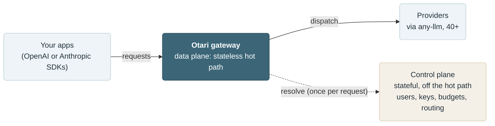
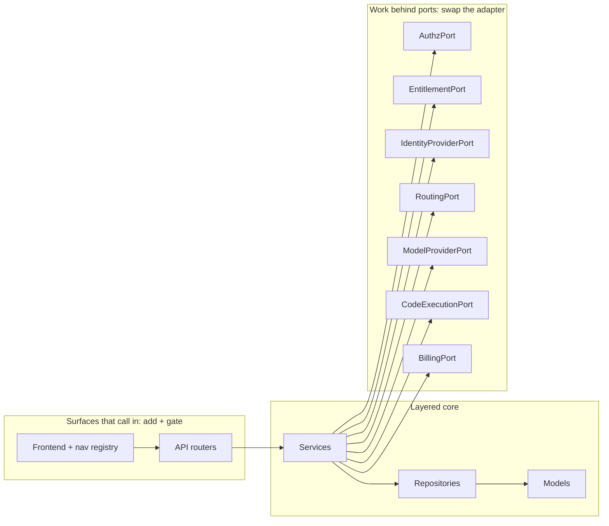

# Architecture

Otari is an OpenAI-compatible LLM gateway, built to be extended. Its core defines a small set of interfaces, called **ports**, and delegates real work to **adapters** that implement them. The core depends only on the ports, never on a specific adapter, so you can supply your own adapter and run it with Otari without changing Otari's code. If you have your own code-execution platform, for example, an adapter that satisfies `CodeExecutionPort` lets Otari drive it; the same is true for routing, identity, and the other ports below.

An **overlay** is a build that layers its own adapters (and its own routers and pages) on top of Otari through these extension points. otari.ai's edition is one such overlay, but it is one among possible many, and nothing in this document is specific to it. This is the open-core shape: Otari is the Apache-2.0 base that stands on its own, and an overlay adds capabilities along a published boundary.

This document is for contributors changing the *shape* of the system. It explains where that boundary is, what Otari's core provides versus what an overlay supplies, and how to add a capability without crossing the line. For the request-level, user-facing picture, start with [docs/index.md](docs/index.md) and [docs/modes.md](docs/modes.md).

## Status: this is a north-star document

This describes the architecture the codebase is **heading toward**, not the whole of what exists today. Otari today is the gateway (the data plane) plus a standalone management API; the ports, the composition container, and the control-plane UI described below arrive as Otari grows into the full open-source base.

Read it with that in mind:

- **"Today" statements** are grounded in what is actually in `src/gateway/` right now, and say so.
- **"Planned" statements** describe target structures that do not exist in the tree yet. Where a structure is planned, the doc names where it will live rather than pretending it is already there.
- A few capability-line rows are explicitly marked **provisional**: the split between what Otari ships and what an overlay adds is a working assumption for those rows, pending a decision, not settled fact.

As the seam is built out, this document and the mechanical boundary check that enforces it (see [Cardinal rules](#cardinal-rules-for-contributors)) are updated together, so the human-readable boundary and the enforced one do not drift.

## The two planes

Otari separates a **data plane** from a **control plane**.

- **Data plane**: the gateway hot path. It authenticates the request, applies input guardrails, runs any built-in tools, and dispatches the provider call through [`any-llm`](https://github.com/mozilla-ai/any-llm). It is stateless and scales with traffic. Today it runs in `src/gateway/`: the request lifecycle in `src/gateway/api/routes/chat.py` (and its siblings `messages.py`, `responses.py`), with streaming in `src/gateway/streaming.py`. `src/gateway/` today also houses the standalone control plane described below, so the package as it stands is not the data plane alone.
- **Control plane**: everything off the hot path. It owns users, orgs, workspaces, keys, budgets, usage, and the routing decision. It is stateful and database-backed. It makes the policy decisions; the data plane executes them.

On the request hot path the two meet through the **resolve protocol**. Before a provider call, the data plane asks the control plane which provider and credentials to use, and gets back an ordered list of attempts:

```http
POST /gateway/provider-keys/resolve  ->  attempts[]
```

Each attempt carries `provider`, `model`, `api_key`, `api_base`, and `managed`. The gateway walks the list in order (retrying the next attempt on a retryable failure, committing on success) and makes **zero routing decisions of its own**. The full wire contract is in [docs/hybrid-mode-protocol.md](docs/hybrid-mode-protocol.md).

The resolve protocol is the seam made concrete on a live boundary: a simple control plane returns a plain ordered list; a richer one could return a smartly selected list; and the gateway cannot tell which answered. The decision-making sits behind the protocol, on the control-plane side, and the gateway stays identical no matter what answers.

Provider resolution is the seam on the request hot path, but it is not the only one. Other capabilities (authorization, identity, entitlements, billing, code execution) sit behind their own ports; several of them back admin-facing and control-plane surfaces rather than the LLM call path.

Today the control plane resolves two ways, selected by [mode](docs/modes.md):

- **Standalone** (default): the gateway resolves against its own local database (users, keys, budgets, usage in `src/gateway/models/entities.py`). This is the open-source control plane in its simplest form.
- **Hybrid** (`OTARI_AI_TOKEN` set): the gateway delegates resolution to a peer over HTTP (`src/gateway/api/routes/_platform.py`). Any service that implements the protocol can answer; otari.ai is the reference peer.

Hybrid mode is a *network* form of this seam, and it is worth not conflating it with an overlay. In hybrid mode a remote control plane answers the resolve protocol over HTTP, out of the gateway's process; the peer can be any service that implements the protocol. An overlay, by contrast, is an *in-process* build that binds its own adapters into the composition container (see [How a port is resolved](#how-a-port-is-resolved)) and runs in the same process as the core. Both let something other than the plain local logic answer; the difference is whether that something runs over the network or in the same process. So a hybrid peer and an overlay are two ways to reach the seam, not the same thing.



## The extension seam: ports and adapters

Otari's core defines interfaces called **ports**, and delegates the real work to **adapters** that implement them. Because the core depends only on the ports and never on a specific adapter, you change what a capability does by binding a different adapter, and the core itself does not change. That dependency line, with the core on one side and the adapters on the other, is the boundary between what Otari ships and what an overlay plugs in.

There are two ways to extend the system across that boundary, because there are two different kinds of thing sitting on it:

- **Work which the core hands off: change it by swapping the adapter.** Some work the core relies on but does not implement itself, such as authorizing a request, choosing the provider attempts, running the inference call, executing sandboxed code, or billing for usage. For each of these the core defines a port and depends on it, and an adapter supplies the actual implementation. Binding a different adapter changes the behavior, and the core stays as it is.
- **Surfaces exposed to callers: change it by adding a surface and gating it.** The API routes and frontend pages that callers reach. Each is registered into a central list the core owns (a router list on the backend, a nav registry on the frontend) and switched on by an entitlement. Extending here means registering a new route or page and gating it, whether that surface ships in Otari's core or comes from an overlay. Nothing is swapped; a surface is added and made conditional.

A **port** is a domain-named interface (a Python `Protocol`), named for what it does, never for how it is implemented (`RoutingPort`, not `SmartRouterClient`). The seam is built around this set of ports:

| Port | Responsibility |
|---|---|
| `AuthzPort` | Authorization decisions (who may do what). |
| `EntitlementPort` | Which capabilities a deployment is entitled to. |
| `IdentityProviderPort` | Authenticating users/sign-in. |
| `RoutingPort` | Choosing the provider/model attempts for a request. |
| `ModelProviderPort` | Executing the model inference call. |
| `CodeExecutionPort` | Running model-generated code in a sandbox. |
| `BillingPort` | Metering and charging for usage. |

The cardinal property: **every port ships with a working adapter in Otari's core**, a real lightweight implementation or an honest [Null Object](https://en.wikipedia.org/wiki/Null_object_pattern). Otari must stand alone with no overlay present. `BillingPort`, for example, is a Null Object in the core: it is present and callable, and does nothing, so nothing in the core needs to know whether real billing exists anywhere.



> **Planned.** A `ports` package and its default adapters do not exist in `src/gateway/` yet. Today the equivalent choices (which credential to use, how to authenticate) are made by the mode switch and hand-wired dependencies described next. The ports formalize those seams as the control plane grows into this repository.

## How a port is resolved

Ports are resolved through a **composition root** and a small **container**, not by scattering concrete class names through the code.

- The **container** is a process-level registry of `Port -> factory` bindings, built **once at startup**. It is a plain Python object (a mapping of port to factory), not a third-party dependency-injection framework and not entry-point auto-discovery. Only a handful of ports ever need swapping, and only at startup, so a thin explicit registry is preferred: a contributor can read the whole wiring in one file, and there is no install-time magic to trace.
- The **composition root** is the single place allowed to name a concrete adapter. It binds the defaults at startup. Everywhere else refers to the *port*, and asks the container for whichever adapter is bound.

Illustrative shape of a resolution (planned; not yet in the tree):

```python
# composition root, at startup: bind the default adapters
container.bind(RoutingPort, lambda session: FallbackRoutingAdapter(session))

# dependency: refers to the port and the container, never a concrete adapter
def get_routing(session: SessionDep, container: ContainerDep) -> RoutingPort:
    return container.routing(session)
```

An overlay (or your own deployment) rebinds ports to its own adapters **without editing any Otari source file**, by supplying a bootstrap module that the container invokes at startup, selected declaratively by configuration (a planned `OTARI_BOOTSTRAP` setting pointing at a registration function). With nothing configured, the defaults stand and Otari boots standalone.

> **Where this lives in the tree.** Today, composition is hand-wired as FastAPI dependencies in `src/gateway/api/deps.py`, and shared resources are attached to `app.state` when the app is built in `create_app` (`src/gateway/main.py`). The container formalizes exactly that hand-wiring: it is built once in `create_app` and resolved through the dependencies in `deps.py`. When the control plane grows into this repository, this is where the composition root lands. It replaces the hand-wiring in `deps.py` rather than living somewhere new.

Not every service goes through a port. Most code has a single implementation and stays plain (see [when a capability earns a port](#cardinal-rules-for-contributors)); only capabilities with a real second implementation are resolved through the container.

## Capability lines: what the core ships vs what an overlay adds

This is the open-core line: for each capability, what Otari's core ships and what an overlay can add. Most of the management plane is plain core code with no port of its own, because each of those features has a single implementation that an overlay has no reason to replace. Having no port of its own does not mean a feature is ungoverned: managing users or budgets is still authorized through `AuthzPort` and gated by `EntitlementPort` like everything else. A feature earns its own port only when a genuine second implementation is in play (see [when a capability earns a port](#cardinal-rules-for-contributors)).

| Capability | Where it lives | Notes |
|---|---|---|
| Users, orgs, workspaces, teams, invitations, budgets, usage and traces, BYO provider keys | **Core** (plain, no port) | The management plane: plain CRUD, one implementation each. Routing has its own row below because, unlike these, it sits behind a port. |
| RBAC | **Core base + overlay adapter** *(provisional)* | Base roles and org scoping in the core; deeper roles, fine-grained permissions, and audit from an overlay adapter. Split pending an open decision. |
| SSO | **Core base + overlay adapter** *(provisional)* | Social sign-in and passkeys in the core; enterprise SSO (for example SAML, enterprise OIDC, directory provisioning) from an overlay adapter. Split pending an open decision. |
| Routing | **Core base + overlay adapter** *(provisional)* | Ordered fallback and policies in the core; a richer model-selection strategy from an overlay adapter. Split pending an open decision. |
| Model inference | **Core port + hosted adapter** | Self-hosting your own backends is a first-class path in the core; a hosted, metered inference backend comes from an overlay. See the managed-models section of [docs/modes.md](docs/modes.md). |
| Code execution | **Core port + hardened adapter** *(provisional)* | A basic local sandbox in the core; a hardened, managed sandbox from an overlay. Interface still provisional. |
| Billing (wallet/payments) | **Overlay-only** | A Null Object (no-op) adapter in the core; real billing exists only in an overlay. |

The **provisional** rows (RBAC, SSO, routing) share one open question: how deep the core base goes before an overlay adapter takes over. That is an open design decision for the project maintainers, not settled yet and not a contributor's to assume; treat those lines as a working assumption until it is decided and recorded here.

The inference and code-execution ports share a shape: a compute-heavy backend behind a port, chosen by the control plane, executed in the data plane. Self-hosting is a first-class path in the core, not a degraded one. In the resolve protocol this seam is already latent: `managed: false` with an `api_base` is the self-hosted path, and `managed: true` is a hosted, metered backend (see [docs/modes.md](docs/modes.md)).

## Deployment and entitlements

Two gates decide whether a piece of behavior runs. They **compose but never merge**, because they answer different questions:

- **Surface** is the topology axis: *does the process serving this URL host this surface at all?* It is answered by the deployment bootstrap (`GET /v1/bootstrap`), whose `surfaces` list the dashboard shell reads once before it renders, and it is the reason a hybrid gateway shows no management UI: its control plane is otari.ai, not itself. Standalone and hosted deployments host the surface; a data-plane gateway does not. It is named `surface` and never `capability`, because otari.ai already spends that word on the entitlement axis below, down to a nav item's `capability` field, and the two vocabularies meet in one shell when the control-plane UI converges.
- **Entitlement** is the licensing axis: *is this capability enabled for this deployment at all?* It is scoped per deployment, never per user. It is resolved by `EntitlementPort`, whose core adapter grants every base capability and reports every overlay-only one as absent; a real resolver is an overlay adapter.

The first is about *where the code is running* and the second about *what this customer bought*. Both are client-side conveniences over server-side authorization: hiding a surface never grants access to it, and the server authorizes every request behind one regardless.

In the dashboard both meet on one nav entry, which is where the vocabulary earns its keep: `web/src/app/nav/registry.ts` declares a destination's `surface` and `capability`, and `useNavVisibility` composes them as AND, so either one hides the link and the shell answers the route behind it with a panel rather than a page. An overlay replaces `web/src/app/nav/overlaySections.ts` (or `overlayNavItems.ts`, for a destination that belongs inside a section the base owns) to register its own destinations, without editing a base source file. The same build-time module override carries a contribution that is not a destination at all but something inside a piece of chrome the base owns: `web/src/app/nav/overlayWalletSlot.tsx` is the slot the top bar mounts for a balance this gateway has none of, and rule 6 is why it exists, since a chip there could otherwise be contributed only by editing the top bar itself. [web/AGENTS.md](web/AGENTS.md) lists the seams and the rule that a base module reaches one by its `@/…` specifier rather than relatively.

Be clear about how much of that is built. The surface axis is real and served: `GET /v1/bootstrap` answers it. **`EntitlementPort` is not implemented anywhere in `src/gateway/`, and no endpoint serves entitlements**, so the entitlement axis resolves entirely in the browser, from the constant that is the default value of the context in `web/src/shared/hooks/useEntitlements.tsx`. It grants `BASE_CAPABILITIES` and reports everything else absent, which is the behavior the core adapter above describes, in the only place there is currently anything to put it. That constant is itself empty, because no base nav entry is gated on a capability: the one candidate is routing, whose split this document still marks provisional. An overlay answers it for real by rendering `EntitlementProvider`.

That is sound while every capability the axis gates belongs to an overlay, since a deployment with no overlay has nothing to withhold. It stops being sound when an overlay mounts a router into this process, because hiding a link is not authorization and that route has to refuse for itself, on `EntitlementPort` and a `require_capability` dependency. The axis does not enforce against the operator, who owns the process; do not let a surface built on the client gate assume a resolver exists.

## Cardinal rules for contributors

These are the rules that keep the boundary from eroding. They apply to anyone adding or moving code across the seam.

1. **Anything that will have more than one implementation lands as a port plus a working core adapter.** If a capability will have a richer alternative behind it, its interface (the port) and a working default both live in the core.
2. **The core ships the base; the richer or specialized implementation lives in an adapter, not in the core.** Fallback routing is core; a model-selection strategy is an adapter. Keep the depth in the adapter.
3. **Every port has a working core adapter.** A real lightweight one or an honest Null Object. Otari must stand alone.
4. **Ports live in the core, in domain terms.** Name the port for the domain (`RoutingPort`), never for an implementation.
5. **Only the composition root names a concrete adapter.** Services, routers, and the frontend refer to ports; the composition root is the single place that binds a concrete one.
6. **An overlay never edits an Otari source file.** It registers into the extension points Otari exposes (the container, the router list, the nav registry) and supplies configuration. If extending an overlay *requires* editing an Otari file, that is a missing seam, and the seam belongs in Otari. Supplying configuration or a bootstrap module is not editing the core.
7. **Introduce a port only when it earns one.** A port that will only ever have one implementation is ceremony with no benefit. A capability earns a port only when a genuine second implementation is real, or a hard boundary (intellectual property, or a hosted service) runs through it. Plain CRUD and infrastructure (user, team, and trace management, and the bulk of orgs/workspaces management) stay concrete in the core. "Most of the management plane is core" and "most services are not ports" are the same statement.

These rules are meant to be enforced mechanically, not only in review. A boundary check (planned: a `check_architecture.py` script run in CI) asserts the layering, for example: ports may import models, exceptions, and core, but not services, API, or any adapter; services may import ports but not a concrete adapter; only the composition root may import an adapter. This document is the human-readable companion to that check; the two are kept in step so the boundary the doc describes is the boundary CI enforces.

## How to add a capability

A step-by-step recipe for adding a capability without crossing the boundary. The `AuthzPort` seam is the reference template every later capability copies.

1. **Decide whether you need a port at all.** Apply rule 7. If the capability is plain management CRUD with no second implementation on the horizon, skip the ceremony: write a normal service and repository in the core and stop here. Only continue if a second implementation is genuinely on the table, or a hard boundary runs through it.
2. **Define the port.** Add a domain-named `Protocol` to the core `ports` package (planned location: `src/gateway/ports/`). It may depend on models, exceptions, and core only, never on services, the API, or an adapter.
3. **Route callers through the port.** Services depend on the port, resolved from the container; they never name a concrete adapter.
4. **Ship a working core adapter.** Add a real lightweight implementation, or an honest Null Object, to the core adapters package. Verify the capability behaves correctly with only this adapter present.
5. **Bind the default in the composition root.** Register `Port -> core factory` in the container built at startup in `create_app`, and resolve it through a dependency in `deps.py`.
6. **If the capability has API or UI surface, add and gate it.** Add its router to the central additive router list (a planned mechanism) and register its nav item into the nav registry (`web/src/app/nav/registry.ts`), each gated by an entitlement. Do not swap anything on this side; add surface and make it conditional.
7. **Verify Otari still stands alone.** It must boot standalone with only the core adapters bound (no overlay bootstrap configured) and pass its smoke suite, and the boundary check must pass. Both are automated: `uv run --frozen --no-dev python scripts/oss_edition_smoke.py` is the smoke suite (run by `.github/workflows/otari-oss-edition.yml` on any pull request that touches the app, the migrations, or dependency resolution), and `make check-architecture` is the boundary check.

Once the seam exists, an overlay adds its own adapter by registering it through these same extension points, with zero edits to Otari's source. Building the seam is core work; using it is overlay work.

## Glossary

- **Capability**: the unit of division along the seam. A vertical slice: a port, one or more adapters, optional API and UI surface, and the entitlement that governs it. "Routing", "billing", "code execution" are capabilities.
- **Port**: a domain-named interface (a Python `Protocol`) the core depends on. Ports live in the core.
- **Adapter**: a concrete implementation of a port. Otari ships a lightweight, always-present adapter for each; an overlay (or your own deployment) can supply a richer one.
- **Overlay**: a build that layers its own adapters, routers, and pages on top of Otari through its extension points, without editing Otari's source.
- **Composition root**: the single place that decides which adapter answers a port. Only it may name a concrete adapter.
- **Container**: the process-level registry of `Port -> factory` bindings, built once at startup.
- **Entitlement**: whether a capability is enabled for a deployment, at capability grain. The licensing axis.
