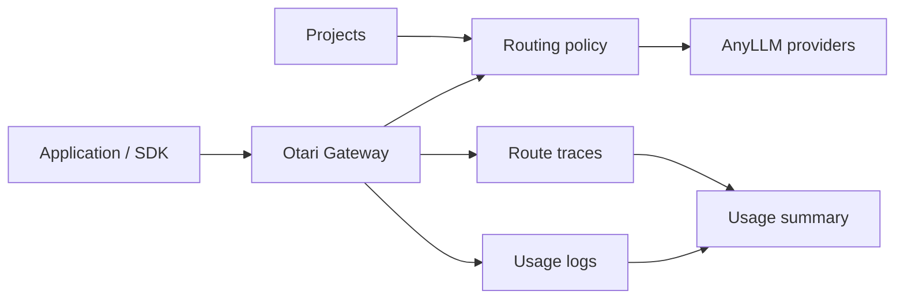

# Merge Gateway Compatibility

This document maps the open-source Otari Gateway routing work to the public
Merge Gateway product concepts. It is meant to make the branch reviewable: what
is implemented, where the API intentionally differs, and what remains future
work.

The public [Merge Gateway page](https://www.merge.dev/gateway) presents Gateway
as a control plane for production AI with one API for major LLMs, routing, cost
controls, observability, and governance. This branch implements the same core
self-hosted shape on top of Otari Gateway and AnyLLM: applications can keep using
OpenAI-compatible endpoints while operators manage routing policies, projects,
model catalogs, usage attribution, and route traces inside their own database.

This is not a hosted Merge replacement. It does not include Merge's dashboard,
payment/invoice consolidation, curated benchmark service, or managed security
filters. It is an Apache-2.0, self-hosted control plane foundation for those
workflows.

## Operator Mental Model



The application sends ordinary OpenAI-compatible requests to the gateway. A
request with `model: "default_routing"` is resolved through the routing control
plane. Project IDs and tags can select policy variants and are carried into
usage logs and route traces for billing, analytics, and debugging.

## Compatibility Matrix

| Merge Gateway concept | OSS gateway surface | Status |
|-----------------------|---------------------|--------|
| One API for multiple providers | `/v1/chat/completions`, `/v1/responses`, `/v1/models`, `/v1/vendors` backed by AnyLLM provider selectors | Implemented |
| Single endpoint swap | OpenAI SDK can point `base_url` at `/v1`; direct provider models use `provider:model` and routed calls use `default_routing` | Implemented |
| Automatic routing by cost, latency, or quality | Routing strategies: `lowest_cost`, `least_latency`, `weighted_score`, `priority`, `cost_tier`, `intelligent`, plus Merge-style `default_strategy` aliases | Implemented |
| Provider fallback | Ordered candidates are attempted before a non-streaming routed response is returned | Implemented |
| Project-scoped control | `/v1/projects` attaches a routing policy to a project; requests can pass `project_id` | Implemented |
| Cost attribution | Usage logs include model, provider, endpoint, project, user, tags, tokens, and cost when pricing exists | Implemented |
| Usage analytics | `/v1/usage` lists exportable logs; `/v1/usage/summary` rolls up count, tokens, and cost by project, user, model, provider, endpoint, status, and tag | Implemented |
| Decision transparency | `/v1/routing/resolve`, `/v1/route-traces`, and `/v1/route-traces/summary` expose selected model, rejected candidates, health, policy source, attempts, outcomes, and cost estimates | Implemented |
| Policy history and rollback | Policy revisions, clone-to-draft, draft/active/archived states, and audited apply-revision rollback | Implemented |
| Canary and segment routing | Tag match rules, nested conditions, operators, priorities, and deterministic rollout buckets | Implemented |
| Passive provider health | Route-trace-derived provider health can observe, down-rank, or skip unhealthy providers | Implemented |
| Model/vendor catalog | `/v1/models?format=gateway`, `model=provider/model`, `/v1/vendors`, and `/v1/vendors/{vendor_id}` | Implemented |
| Per-customer model or region policies | Provider/model allow/block constraints and region-aware candidate metadata can route or reject by request tags | Implemented |
| Real-time budget caps and warnings | User, project, and tag-scoped team/customer-tier budgets block requests before provider dispatch, track matching spend, emit durable threshold alert events, and optionally deliver webhooks with backoff, background retries, and dead-letter status | Implemented |
| Build-your-own benchmark router | `weighted_score` combines configured or uploaded benchmark/quality scores, estimated cost, and recent latency with transparent score components; `scripts/apply_eval_scores.py` normalizes generated eval artifacts into policy updates | Implemented |
| Data-loss prevention and prompt-injection protection | Policy-level `guardrails` can block, observe, or redact routed requests using reusable managed OSS presets, configured terms/patterns, built-in PII patterns, prompt-injection phrases, credential-leak patterns, and external HTTP classifier services | Implemented |
| Context compression | Policy-level `context` policies can trim older turns or replace them with deterministic extractive summaries while preserving system/developer prompts plus newest turns before provider dispatch | Implemented |
| Hosted dashboard and billing consolidation | Self-hosted `/admin` dashboard covers routing policies, revision rollback, route traces, usage summaries, and budget alerts; hosted billing consolidation remains out of scope | Partial |

## Core Request Shapes

Direct model call:

```json
{
  "model": "openai:gpt-4o-mini",
  "messages": [{ "role": "user", "content": "Say hello" }]
}
```

Default-routed call:

```json
{
  "model": "default_routing",
  "project_id": "prod-chat",
  "tags": {
    "tenant": "enterprise",
    "surface": "chat"
  },
  "messages": [{ "role": "user", "content": "Say hello" }]
}
```

Merge-style omitted/null/case-insensitive routing sentinel compatibility is
supported for chat completions, Responses, and dry-run route resolution.

## Policy Shapes

Native Otari routing policy:

```json
{
  "name": "Cost-aware production router",
  "strategy": "lowest_cost",
  "is_default": true,
  "config": {
    "fallback_enabled": true,
    "candidates": [
      {
        "model": "openai:gpt-4o-mini",
        "input_price_per_million": 0.15,
        "output_price_per_million": 0.60
      },
      "anthropic:claude-3-5-haiku-latest"
    ]
  }
}
```

Merge-style `default_strategy` alias:

```json
{
  "name": "Quality-first router",
  "is_default": true,
  "default_strategy": {
    "type": "intelligent",
    "axis": "intelligence",
    "providers": [
      { "provider": "openai", "model": "gpt-4o-mini" },
      { "provider": "anthropic", "model": "claude-3-5-haiku-latest" },
      { "provider": "openai", "model": "gpt-4o" }
    ]
  }
}
```

Weighted benchmark router:

```json
{
  "name": "Benchmark-weighted router",
  "is_default": true,
  "default_strategy": {
    "type": "weighted_score",
    "scoring": {
      "weights": { "quality": 0.7, "cost": 0.2, "latency": 0.1 }
    },
    "providers": [
      {
        "provider": "openai",
        "model": "gpt-4o",
        "quality_score": 0.95,
        "input_price_per_million": 5.0,
        "output_price_per_million": 15.0
      },
      {
        "provider": "openai",
        "model": "gpt-4o-mini",
        "quality_score": 0.72,
        "input_price_per_million": 0.15,
        "output_price_per_million": 0.60
      }
    ]
  }
}
```

Eval score import:

```json
{
  "scores": [
    {
      "model": "openai:gpt-4o",
      "score": 92,
      "metric": "mt_bench",
      "sample_count": 50
    },
    {
      "provider": "openai",
      "model": "gpt-4o-mini",
      "quality_score": 0.72,
      "metric": "internal_eval",
      "sample_count": 100
    }
  ],
  "change_note": "Import nightly eval results"
}
```

Generated eval pipeline:

```bash
/tmp/uv-bin/uv run python scripts/apply_eval_scores.py \
  --input evals/nightly.jsonl \
  --policy-id rp_123 \
  --metric nightly_eval \
  --change-note "Import nightly eval results"
```

Segment/canary policy:

```json
{
  "name": "VIP canary",
  "strategy": "priority",
  "is_default": false,
  "config": {
    "match": {
      "all": [
        { "tag": "tenant", "operator": "eq", "value": "vip" },
        { "tag": "usage_score", "operator": "gte", "value": 80 }
      ],
      "priority": 50,
      "rollout_percentage": 25,
      "bucket_by": "tenant"
    },
    "candidates": ["openai:gpt-4o"]
  }
}
```

## Review Checklist

Use this list to review the branch against the intended control-plane behavior.

| Area | Files and endpoints |
|------|---------------------|
| Schema | `src/gateway/models/entities.py`, `alembic/versions/*routing*`, `alembic/versions/*usage*` |
| Routing engine | `src/gateway/services/routing_policy_service.py` |
| Routed chat | `POST /v1/chat/completions`, `src/gateway/api/routes/chat.py` |
| Routed Responses | `POST /v1/responses`, `src/gateway/api/routes/responses.py` |
| Policy management | `/v1/routing-policies`, `/v1/projects` |
| Dry-run and traces | `/v1/routing/resolve`, `/v1/route-traces`, `/v1/route-traces/summary` |
| Usage export and analytics | `/v1/usage`, `/v1/usage/summary` |
| Model/vendor catalog | `/v1/models?format=gateway`, `/v1/vendors` |
| Admin dashboard | `/admin`, plus the management APIs it calls |
| Demo | `demo/routing-gateway/README.md` and `demo/routing-gateway/demo_flow.sh` |

## Validation

The local validation ladder for this branch is:

```bash
/tmp/uv-bin/uv run ruff check
/tmp/uv-bin/uv run mypy
/tmp/uv-bin/uv run pytest tests/unit -q
TEST_DATABASE_URL=sqlite:////tmp/routerproject-integration-preflight.sqlite /tmp/uv-bin/uv run pytest tests/integration/test_routing_gateway.py tests/integration/test_usage_endpoint.py -q --reruns 0
# With TEST_DATABASE_URL pointed at PostgreSQL:
/tmp/uv-bin/uv run pytest tests/integration -q --reruns 0
/tmp/uv-bin/uv run python scripts/generate_openapi.py --check
git diff --check
```

Docker is required for the default Testcontainers-backed integration suite
unless `TEST_DATABASE_URL` points at an existing PostgreSQL database. This
branch has also been validated locally with a temporary PostgreSQL 17 database
created from the Homebrew `postgresql@17` formula.

## Future Work

- Hosted eval runners, managed benchmark libraries, and scheduler UI.
- LLM-backed or custom summarizer pipelines for context compression.
- Hosted billing consolidation and provider invoice reconciliation.
